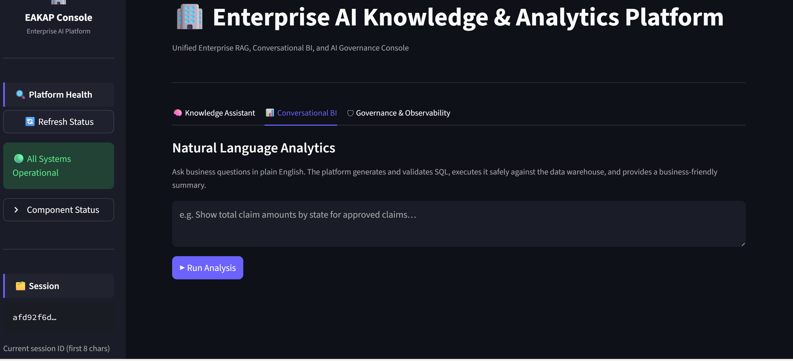
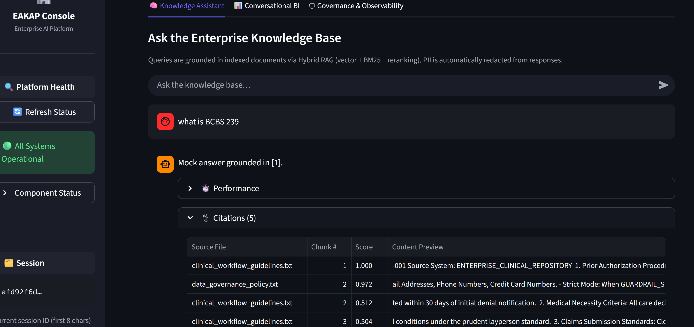
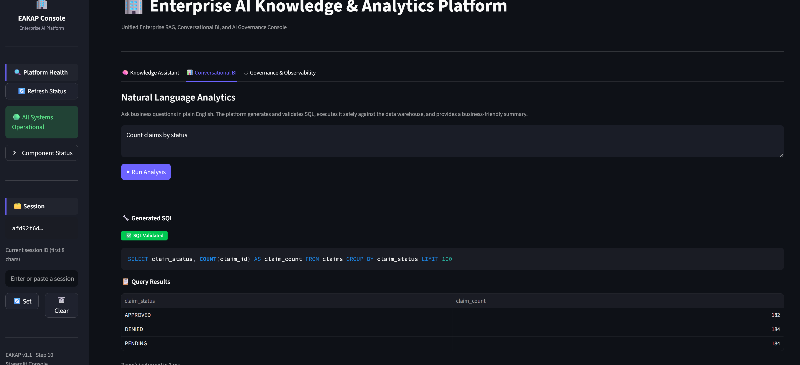
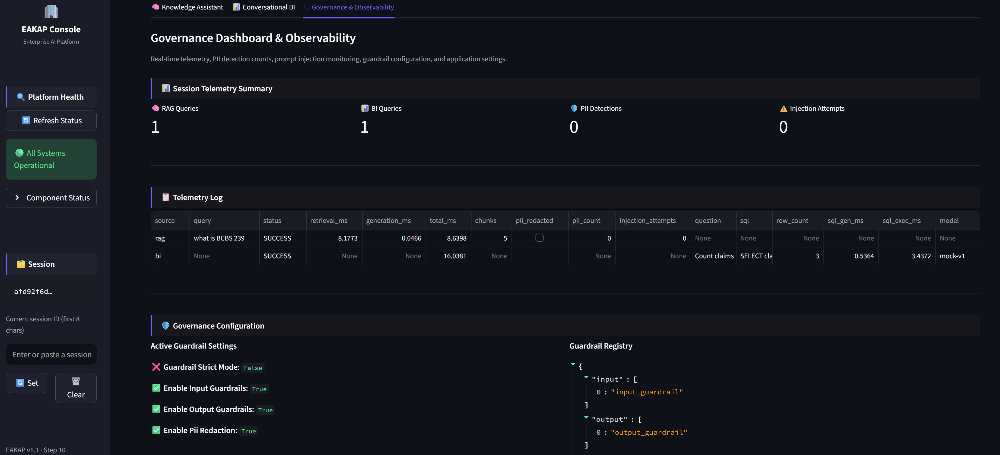

# Enterprise AI Knowledge & Analytics Platform (EAKAP)

> **An Enterprise-Grade AI Platform combining Retrieval-Augmented Generation (RAG), Conversational BI, AI Governance, Hybrid Search, and Enterprise Knowledge Management into a modular, production-ready architecture.**


---

# Enterprise AI Knowledge & Analytics Platform (EAKAP)

EAKAP is a modular, enterprise-ready AI platform designed to help organizations build secure, explainable, and governable AI applications over enterprise knowledge and structured data.

Unlike traditional AI chatbots, EAKAP combines:

- Enterprise Retrieval-Augmented Generation (RAG)
- Conversational Business Intelligence
- Natural Language → SQL Analytics
- Hybrid Search (Vector + BM25 + Rank Fusion)
- AI Governance & Guardrails
- Conversational Memory
- Metadata-driven Knowledge Management
- Enterprise Data Governance concepts

The project is designed using **Domain-Driven Design (DDD)**, **SOLID principles**, and **Clean Architecture** to provide a scalable foundation for production AI systems.

---

# 🚀 Key Highlights

- Enterprise RAG pipeline
- Hybrid Retrieval (Vector + BM25 + Reciprocal Rank Fusion + Re-ranking)
- Conversational BI (Natural Language → SQL)
- Enterprise AI Governance
- Streamlit Enterprise Console
- ChromaDB Vector Database
- SQLite Analytics Engine
- Ollama / Mock LLM abstraction
- Docker & Docker Compose support
- GitHub Actions CI
- Production-oriented architecture
- 104 automated tests (100% passing)

---

# Why EAKAP?

Enterprise organizations struggle with:

- Knowledge scattered across documents
- LLM hallucinations
- Lack of AI governance
- Missing conversational context
- Natural language access to enterprise data
- Limited observability
- Security and PII concerns

EAKAP addresses these challenges by integrating enterprise architecture patterns with modern Generative AI techniques.

---

# Enterprise Architecture

```text
                        ┌─────────────────────────────────────────┐
                        │      Enterprise AI Console             │
                        │     Streamlit + FastAPI Layer          │
                        └──────────────────┬──────────────────────┘
                                           │
                     ┌─────────────────────┼──────────────────────┐
                     │                     │                      │
                     ▼                     ▼                      ▼
             Knowledge Assistant    Conversational BI     Governance Console
                     │                     │                      │
                     ▼                     ▼                      ▼
               Query Engine        NL → SQL Engine        Guardrail Engine
                     │                     │                      │
                     ▼                     ▼                      ▼
            Hybrid Retrieval       SQL Validator          Telemetry
         (Vector + BM25 + RRF)           │                      │
                     │                   ▼                      │
                     ▼              SQLite Database            │
               Context Builder                                │
                     │                                        │
                     ▼                                        ▼
               Ollama / Mock LLM                      Health Monitoring
                     │
                     ▼
           Enterprise Knowledge Base
              (ChromaDB Vector Store)
```

---

# Core Features

## Knowledge Assistant (Enterprise RAG)

- Enterprise document ingestion
- Intelligent document chunking
- Embedding generation
- ChromaDB vector storage
- Hybrid Retrieval
- Prompt management
- Context building
- Conversation memory
- Grounded responses
- Source citations
- Performance telemetry

---

## Hybrid Retrieval

- Dense Vector Search
- BM25 Search
- Reciprocal Rank Fusion
- Cross Encoder Re-ranking
- Context optimization

---

## Conversational BI

Ask business questions in plain English.

Example:

```
Count claims by status

Show total claim amount by status

Average claim amount

Top 10 claims
```

Pipeline:

Natural Language

↓

SQL Generation

↓

SQL Validation

↓

SQLite Execution

↓

Business Summary

↓

Automatic Visualization

Features:

- Natural Language → SQL
- Schema inspection
- SQL validation
- Read-only enforcement
- Automatic charts
- Business summaries

---

## Enterprise AI Governance

Built-in governance capabilities:

- Input Guardrails
- Output Guardrails
- Prompt Injection Detection
- PII Detection
- PII Redaction
- Governance Telemetry
- Runtime Health Checks
- Security Configuration

---

## Enterprise Console (Streamlit)

The Streamlit Enterprise Console provides three major workspaces.

### Knowledge Assistant

- Conversational AI
- Hybrid RAG
- Conversation history
- Citations
- Performance metrics

### Conversational BI

- Natural language analytics
- SQL generation
- SQL validation
- Interactive tables
- Automatic charts
- Business summaries

### Governance & Observability

- Platform health
- Telemetry dashboard
- PII monitoring
- Injection tracking
- Guardrail configuration
- Runtime metrics

---

# Technology Stack

| Category | Technology |
|-----------|------------|
| Language | Python 3.11 |
| UI | Streamlit |
| API | FastAPI |
| LLM | Ollama / Mock LLM |
| Vector Database | ChromaDB |
| Analytics Database | SQLite |
| Retrieval | BM25 + Dense Retrieval |
| Embeddings | Sentence Transformers |
| Architecture | DDD + SOLID |
| Testing | PyTest |
| CI/CD | GitHub Actions |
| Containerization | Docker & Docker Compose |
| Logging | Python Logging |

---

# Project Structure

```text
enterprise-ai-knowledge-analytics-platform/

├── src/
│   ├── analytics/
│   ├── app/
│   │   ├── ui/
│   │   └── health_service.py
│   ├── common/
│   ├── governance/
│   └── rag/
│       ├── context/
│       ├── embeddings/
│       ├── ingestion/
│       ├── llm/
│       ├── memory/
│       ├── pipeline/
│       ├── prompts/
│       └── retrieval/
│
├── docs/
├── tests/
├── data/
├── docker-compose.yml
├── Dockerfile
├── requirements.txt
├── requirements-ui.txt
└── README.md
```

---

# Installation

```bash
git clone https://github.com/kartheek274/enterprise-ai-knowledge-analytics-platform.git

cd enterprise-ai-knowledge-analytics-platform

python -m venv .venv

# Windows
.venv\Scripts\activate

# Linux / macOS
source .venv/bin/activate
```

Install dependencies:

```bash
pip install -r requirements-ui.txt
```

---

# Configuration

Create a `.env` file.

```text
APP_ENV=development

LLM_PROVIDER=ollama

OLLAMA_BASE_URL=http://localhost:11434

LLM_MODEL=llama3

CHROMA_PATH=data/vector_store
```

---

# Running the Application

Launch the Enterprise Console:

```bash
streamlit run src/app/ui/main_app.py
```

---

# Running Tests

```bash
pytest
```

Current Status:

```
104 Passed
0 Failed
```

---

# Docker

Build:

```bash
docker build -t eakap .
```

Run:

```bash
docker compose up
```

---

# GitHub Actions

Continuous Integration automatically:

- Installs dependencies
- Runs the test suite
- Validates pull requests
- Ensures build stability

---

# Screenshots

Create the following directory:

```
docs/screenshots/
```

Recommended screenshots:

```
home.png

knowledge-assistant.png

conversational-bi.png

governance-dashboard.png
```

Example:

```markdown
## Enterprise Console



## Knowledge Assistant



## Conversational BI



## Governance Dashboard


```

---

# Testing

Current automated coverage includes:

- Retrieval
- Hybrid Search
- Conversational Memory
- Analytics Engine
- Governance
- UI Components
- Runtime Integration
- Health Services

104 automated tests pass successfully.

---

# Design Principles

The platform follows:

- Domain-Driven Design (DDD)
- SOLID Principles
- Clean Architecture
- Separation of Concerns
- Dependency Injection
- Modular Service Layer
- Enterprise Security Patterns

---

# Roadmap

## ✅ Version 1.1

- Enterprise RAG
- Hybrid Retrieval
- Conversational BI
- AI Governance
- Streamlit Enterprise Console
- Docker Support
- GitHub Actions
- Runtime Health Monitoring
- Production Hardening

---

## 🚀 Version 2.0

- Authentication
- Role-Based Access Control (RBAC)
- Multi-user Sessions
- Azure OpenAI
- AWS Bedrock
- Enterprise Observability
- Model Evaluation Framework
- Feedback Loop
- Agentic AI
- Multi-Agent Collaboration

---

# Documentation

See the `docs/` folder for:

- Architecture Diagrams
- Governance Policies
- Data Dictionary
- ER Diagram
- Design Decisions
- Deployment Notes

---

# Contributing

Contributions are welcome.

1. Fork the repository
2. Create a feature branch
3. Commit your changes
4. Open a Pull Request

---

# License

MIT License

---

# Author

## Kartheek Jagarlamudi

**Senior Analytics Consultant | Enterprise AI | Data Governance | Generative AI | Machine Learning**

Experienced in designing enterprise-scale AI, analytics, and governance solutions across banking, financial services, and healthcare domains.

---

# Future Vision

EAKAP is designed as the foundation for a next-generation Enterprise AI Platform supporting:

- Enterprise Knowledge Management
- Intelligent Enterprise Search
- AI Governance
- Data Governance
- Enterprise Analytics
- Agentic AI
- Multi-Agent Systems
- AI Observability
- AI Operations (AIOps)
- Enterprise Decision Intelligence