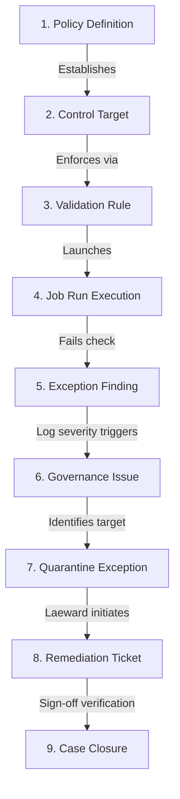
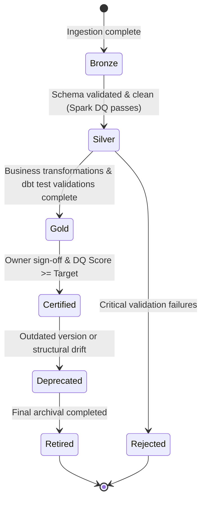

# Governance Policies & Lifecycles Guide

This document describes the governance models, issue management processes, validation workflows, certification schemas, and versioning rules implemented in the Enterprise Data Trust Framework (EDTF).

---

## 1. The Policy-to-Closure Lifecycle

To maintain compliance (e.g., for BCBS 239 or GDPR), every data quality finding or exception must map back to a governing policy. We model this sequence across the database schemas:

### 1.1 Lifecycle Phase Implementations
1. **Policy Definition** (`master.policy_definitions`): Establishes compliance rules (e.g., "All customer transactions must be audited for fraud").
2. **Control Target**: A specific check requirement linked to a dataset or column.
3. **Validation Rule** (`master.data_quality_rules`): Technical assertions (e.g., `transaction_amount > 0`).
4. **Job Run Execution** (`runtime.validation_run_history`): PySpark or dbt execution runs that record test executions.
5. **Exception Finding** (`runtime.findings`): Logs a rule failure during a validation run.
6. **Governance Issue** (`runtime.issue_history`): Created if a critical rule fails, generating a tracking ID.
7. **Quarantine Exception** (`runtime.exception_repository`): Failed rows are redirected to a quarantine area, preventing them from reaching the Silver/Gold analytical layers.
8. **Remediation Action** (`runtime.remediation_history`): Stewards document correction actions (e.g., reloading source files or fixing code bugs).
9. **Case Closure**: Data Stewards and Owners verify the fix and close the tracking ticket.

---

## 2. Issue Management SLA Matrix

Issues logged in `runtime.issue_history` follow strict resolution timelines based on their severity classifications:

| Issue Priority | Issue Severity | Targets Affected | SLA Resolution Target | Escalation Trigger |
| :--- | :--- | :--- | :--- | :--- |
| **CRITICAL** | **CRITICAL** | CDE columns, Gold Core reports, Ledger assets | **4 Hours** | Immediate notification to Data Owner & CIO |
| **HIGH** | **HIGH** | Silver columns, Regulatory tables | **24 Hours** | Escalates to Data Steward lead after 12 hours |
| **MEDIUM** | **MEDIUM** | Sandbox data, Internal files | **5 Business Days** | Review during weekly sprint alignment |
| **LOW** | **LOW** | System operational logs | **30 Business Days** | Automatically auto-archived after 90 days |

---

## 3. Dataset Certification & Medallion Pipeline

Certification states in `master.dataset_registry.certification_status` govern downstream data access and usage permissions.

* **Bronze (Raw Zone)**: Raw, unchanged ingestion data. Access is restricted to engineering service accounts.
* **Silver (Cleaned Zone)**: Standardized schemas. PII columns are masked, and invalid rows are routed to quarantine.
* **Gold (Business Zone)**: Enriched star schemas. Validated by dbt, this layer is ready for business intelligence and analytics.
* **Certified**: Certified for production reporting. Datasets must maintain a `composite_dq_score` above the defined threshold (e.g., `99.90%`) for 14 consecutive days.
* **Provisionally Certified**: Approved for sandbox analytics despite minor data quality warnings.
* **Deprecated**: Scheduled for retirement; users are advised to migrate to newer datasets.
* **Retired**: Inactive and archived; data access is disabled.

---

## 4. Metadata Governance Lifecycle

Metadata configurations (such as rules, schemas, and glossary terms) must pass through a formal approval workflow.

| Lifecycle State | Description | Transition Roles |
| :--- | :--- | :--- |
| **Draft** | Rule or term definition is being drafted. | Data Steward |
| **Submitted** | Definition is complete and awaiting review. | Data Steward |
| **Reviewed** | Checked for technical correctness. | Data Steward Lead / Architect |
| **Approved** | Signed off for compliance and business alignment. | Data Owner |
| **Published** | Staged in the Metadata Master DB. | DevOps / Release Manager |
| **Active** | Loaded into memory and used in production runs. | System Orchestrator |
| **Deprecated** | Flagged as outdated; scheduled for decommissioning. | Data Owner / steward |
| **Retired** | Deactivated; no longer checked in runs. | Data Owner |
| **Archived** | Moved to historical audit tables. | System Archivist |

---

## 5. Version Control Strategy

We use semantic versioning (`Major.Minor.Patch`) combined with effective and expiration timestamps to track change history across metadata tables.

* **Major Version Change (`+1.0.0`)**: Triggered by breaking structural changes (e.g., deleting a column, changing data types, or adding critical validation rules).
* **Minor Version Change (`+0.1.0`)**: Triggered by non-breaking changes (e.g., adding nullable columns, updating thresholds, or adding non-critical warning rules).
* **Patch Version Change (`+0.0.1`)**: Triggered by minor documentation or glossary description updates.

### 5.1 Temporal Versioning (Slowly Changing Dimensions)
All configurations use temporal versioning (`effective_date` and `expiry_date`).
When a rule is modified:
1. The current active version record's `expiry_date` is updated to the current timestamp, and its `is_active` flag is set to `false`.
2. A new record is inserted with the updated configuration, incremented version string, `effective_date` set to the current timestamp, and `expiry_date` set to `NULL`.
3. The API and Spark engines automatically filter for `is_active = true` and `expiry_date IS NULL` to read the active configuration at runtime.
