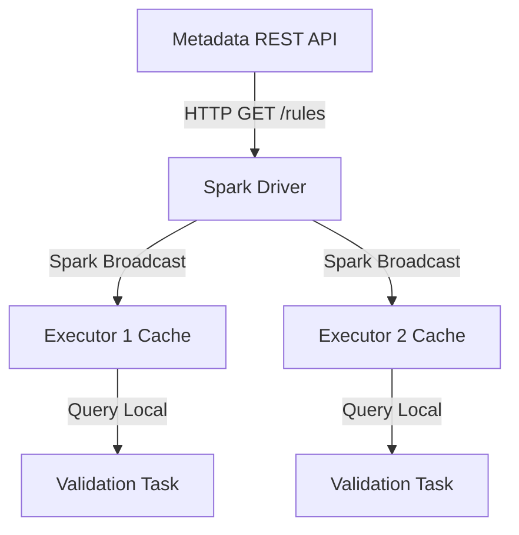
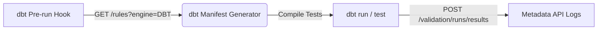
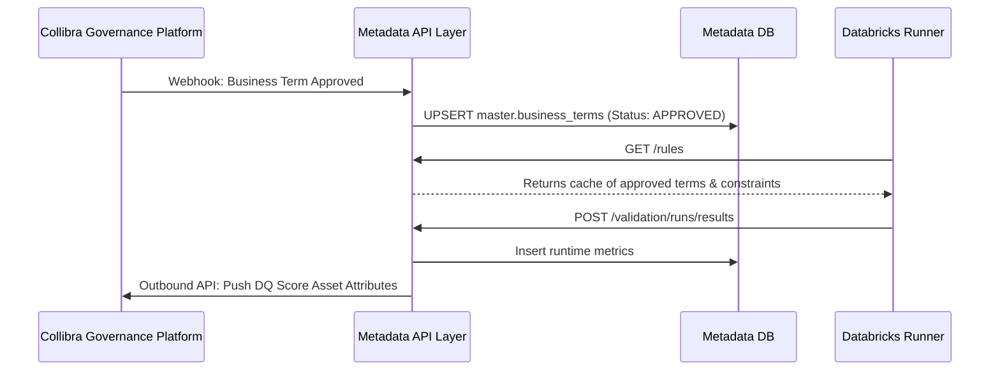
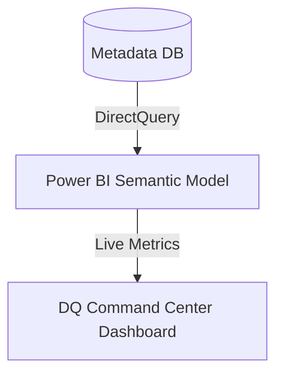

# Consumer Integration Frameworks Guide

This document describes how Databricks PySpark, dbt Core, Collibra, Microsoft Purview, and Power BI consume and publish metadata using the Enterprise Data Trust Framework (EDTF) API Layer.

---

## 1. PySpark & Databricks Caching Strategy

To avoid overwhelming the Metadata API layer during parallel execution of massive Spark workloads (hundreds of executors executing validation steps concurrently), we implement a tiered caching strategy.

### 1.1 In-Memory Caching and Broadcast Variables
* **Dynamic Broadcast Variables**: During the startup of a Databricks migration job, the Spark Driver requests data quality rules, schemas, and lookup datasets from `/datasets/{dataset_id}/rules` and `/datasets/{dataset_id}/columns`. The Driver encapsulates these into a Spark `Broadcast` variable (`sparkContext.broadcast(rules_dict)`).
* **Executor-Level Cache**: Large reference datasets (like ISO lists, IFSC directories, or status codes) are cached directly in executor memory as local Python dictionaries, preventing redundant JDBC calls.
* **Live Inquiries**: Run-state updates (such as pipeline start time or heartbeats) bypass the cache and are POSTed live to `/validation/runs`.

### 1.2 Cache Invalidation & Version Sync
1. **Rule Version Header**: The API provides an `X-Metadata-Version` header containing a cryptographic checksum of the rule configurations.
2. **Heartbeat Checker**: Spark streaming jobs check `/auth/version` every 5 minutes. If a version mismatch is detected (due to an approved rule change in the audit store), the driver calls `.unpersist()` on the existing broadcast variable and broadcasts the new rule payload.

### 1.3 Spark Failure Handling
* **API Degradation (Circuit Breakers)**: If the Metadata API is unreachable (5xx errors), the Spark runner halts processing for `CRITICAL` datasets and logs the event. For non-critical pipelines, it falls back to a locally persisted JSON backup configuration in the cluster DBFS/OneLake storage path.

---

## 2. dbt Integration Framework

dbt runs transformation pipelines in the Silver and Gold zones. Instead of defining static tests in `schema.yml` files, dbt compiles tests dynamically by querying rule definitions from the Metadata API.

### 2.1 Metadata Consumption
* **Pre-Compile Hook**: A custom dbt macro (`get_metadata_rules()`) executes during the pre-compilation step. It issues a `GET` request to `/datasets/{dataset_id}/rules?engine=DBT` and outputs the target constraints directly into temporary configuration maps.
* **Dynamic Generic Tests**: Custom dbt tests (e.g., `generic_metadata_integrity`) parse parameters (like minimum/maximum values or lookup references) and inject them into SQL queries compiled at runtime.

### 2.2 Metadata Publishing
* **Post-Run Ingestion**: A post-run hook executes `POST /validation/runs/{id}/results`. It parses the local dbt artifact (`target/run_results.json`) and exports the results (test passes, failures, compile times, and SQL errors) to the Metadata DB.

---

## 3. Collibra Integration Architecture

Collibra acts as the **Enterprise Governance System of Record (SoR)**. It defines business terms, owns glossaries, controls classification tags, and manages approvals. The Metadata DB acts as the **Runtime Engine and Local Cache**.

### 3.1 Inbound Sync (Collibra → Metadata DB)
* **Webhook Listeners**: When a data steward approves a business term, mapping, or policy in Collibra, a webhook calls the Metadata API `/glossary/terms` or `/policies` endpoints.
* **REST Sync Ingestion**: A nightly synchronization script polls Collibra's Core APIs (`/assets`, `/relations`) to sync schema models and identify differences, updating `master.column_metadata` with the latest tags.

### 3.2 Outbound Sync (Metadata DB → Collibra)
* **Metrics Ingestion**: The Metadata API pushes run statistics to Collibra using the Collibra Import API.
* **Exceptions Log**: Open exceptions from `runtime.exception_repository` are pushed to Collibra as "Data Quality Issue" assets, launching Collibra workflow tasks assigned to the responsible Data Stewards.

---

## 4. Microsoft Purview Integration

Microsoft Purview provides search, security tagging, and automated lineage visualization.

* **Asset Registration**: When a new dataset is added to `master.dataset_registry`, the API registers it in Microsoft Purview using the Atlas API (`/api/atlas/v2/entity`).
* **Lineage Synchronization**: Lineage relationships stored in `master.lineage_definitions` are posted to Purview as Atlas relationships. This populates end-to-end lineage visualizations in Microsoft Fabric and Azure Synapse.
* **Classification Matching**: Classifications applied during profiling (e.g., matching a PII tag like `CREDIT_CARD_NUMBER`) are synchronized with Purview's classification rules.

---

## 5. Power BI Reporting Integration

Power BI reads metadata and execution logs to build the **Data Quality Command Center** dashboard.

### 5.1 Metrics Visualized
1. **Reconciliation Variances**: Highlights variance indicators comparing `source_checksum_val` against `target_checksum_val` across core ledgers.
2. **Data Quality Scorecard**: Computes and displays DQ compliance rates categorized by domain:
   $$\text{Compliance Rate} = \frac{\text{Passed Checks}}{\text{Total Evaluated Checks}} \times 100\%$$
3. **Certification Badging**: Displays certification badges (Bronze, Silver, Gold, Certified) derived from `master.dataset_registry.certification_status`.
4. **Lineage Visualization**: Embeds lineage mappings from `/lineage` in custom HTML/SVG trees to show the impacts of data quality errors.
5. **Quarantine Metrics**: Aggregates open exception counts from `runtime.exception_repository` to track SLAs and resolve aging quarantine items.
