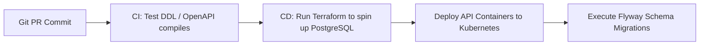

# Standards, Operations, & Deployment Guide

This document establishes the metadata standards, naming conventions, coding standards, and deployment guides for the Enterprise Data Trust Framework (EDTF).

---

## 1. Enterprise Metadata Standards

To maintain semantic consistency across global banking entities, all metadata registered in the framework must comply with the following standards:

### 1.1 Classification Standards
* **PII Data Elements**: Must be mapped to `CLASS_CONFIDENTIAL` (confidential classification) and have a dedicated masking policy ID in `security.column_security`.
* **Financial Ledgers**: Target balances, transaction values, and checksum fields must be marked as Critical Data Elements (CDEs) in `master.critical_data_elements` with a regulatory mandate tag (e.g. `BCBS-239` or `SOX`).
* **Temporal Audits**: Every table across all schemas must include `created_at` and `updated_at` columns of type `TIMESTAMP WITH TIME ZONE` (defaulting to UTC).

### 1.2 System Naming Conventions
* **Database & Table Identifiers**: Must use lower `snake_case` (e.g. `dataset_registry`, `business_terms`).
* **Primary Key ID Fields**: Must append `_id` suffix (e.g. `domain_id`, `rule_id`).
* **Foreign Key References**: Must match the referenced primary key column name exactly (e.g. `master.business_terms.owner_id` references `master.data_owners.owner_id`).
* **Status Flags**: All state variables must use uppercase strings (e.g. `DRAFT`, `SUBMITTED`, `APPROVED`, `ACTIVE`, `RETIRED`).
* **API Route Slugs**: Must use lower `kebab-case` (e.g. `/auth/token`, `/datasets/{dataset_id}/rules`).

---

## 2. Coding Standards

### 2.1 SQL Formatting and Best Practices
* **ANSI Compliance**: All SQL statements (DDL and DML) must follow ANSI SQL:2016 standards and support PostgreSQL syntax.
* **Keyword Uppercasing**: SQL keywords must be written in uppercase (e.g. `SELECT`, `FROM`, `WHERE`, `JOIN`, `CREATE TABLE`).
* **Explicit Column Declarations**: Avoid using `SELECT *` in database transformations. Declare column names explicitly to prevent schema drift errors.
* **Foreign Key Constraints**: All master tables must define explicit primary and foreign key constraints to maintain referential integrity.

### 2.2 Configuration Versioning
* **Git Branching Strategy**: Developers must use the standard GitOps workflow:
  * Master Metadata Branch: `main` (requires peer approvals and automated testing).
  * Feature Branches: `feat/add-dq-rules-abc` or `fix/reconciliation-logic`.
* **API Schema Versioning**: API route paths include version prefixes (e.g., `/v1/...`). Changes that break backward compatibility require creating a new route directory (e.g., `/v2/...`).

---

## 3. Implementation and Deployment Guide

Deploying the EDTF Metadata Platform involves establishing database schemas, setting up the API microservice, and configuring CI/CD automation.



### 3.1 Step 1: Provision Infrastructure (Terraform)
The database, Kubernetes cluster (for API hosting), and Redis caches are provisioned using Terraform.
1. Run `terraform init` to download cloud provider plugins.
2. Review configuration settings in `variables.tf`.
3. Deploy resources:
   ```bash
   terraform plan -out=tfplan.binary
   terraform apply tfplan.binary
   ```

### 3.2 Step 2: Initialize Database Schemas (Flyway)
To deploy the database DDL files in sequence and manage updates, use the Flyway migration tool:
1. Copy the SQL DDL files from `db/ddl/` to your Flyway migration directory, renaming them to follow the versioning format (e.g., `V1__master_repository.sql`).
2. Run the migration command:
   ```bash
   flyway -url=jdbc:postgresql://<db_host>:5432/metadata_db -user=<admin> -password=<pass> migrate
   ```

### 3.3 Step 3: Seed Reference and Master Data
Use PostgreSQL import commands to load initial reference lists from `/db/seeds/` to seed values:
```bash
psql -h <db_host> -U <user> -d metadata_db -c "\copy reference.countries FROM 'db/seeds/09_countries.csv' DELIMITER ',' CSV HEADER"
```

---

## 4. Operations and Monitoring Guide

### 4.1 Automated API Status Checks
Deploy a monitoring check that sends HTTP GET requests to the `/auth/health` endpoint of the API layer every 10 seconds:
```json
{
  "status": "healthy",
  "database_connected": true,
  "redis_cache_connected": true,
  "api_version": "1.0.0"
}
```

### 4.2 Database Backup and Patching Window
* **Backup Schedule**: Automated daily database backups with 35-day retention. Transaction logs are backed up every 5 minutes to support Point-in-Time Recovery (PITR).
* **Patching Window**: Database engine patches are applied on Sundays at 02:00 UTC using high-availability, multi-region failover to avoid service interruptions.
